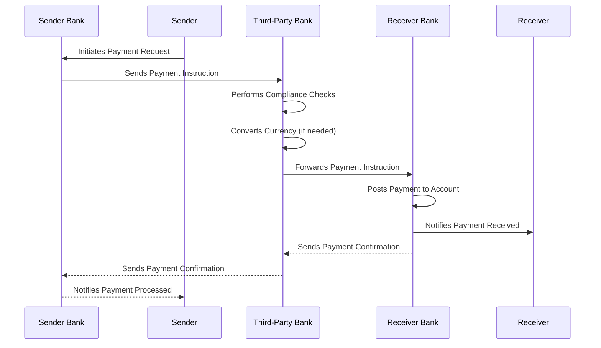

```mermaid
sequenceDiagram
    participant SenderBank as Sender Bank
    participant Sender
    participant ThirdPartyBank as Third-Party Bank
    participant ReceiverBank as Receiver Bank
    participant Receiver

    Sender->>SenderBank: Initiates Payment Request
    SenderBank->>ThirdPartyBank: Sends Payment Instruction
    ThirdPartyBank->>ThirdPartyBank: Performs Compliance Checks
    ThirdPartyBank->>ThirdPartyBank: Converts Currency (if needed)
    ThirdPartyBank->>ReceiverBank: Forwards Payment Instruction
    ReceiverBank->>ReceiverBank: Posts Payment to Account
    ReceiverBank->>Receiver: Notifies Payment Received
    ReceiverBank-->>ThirdPartyBank: Sends Payment Confirmation
    ThirdPartyBank-->>SenderBank: Sends Payment Confirmation
    SenderBank-->>Sender: Notifies Payment Processed
```
