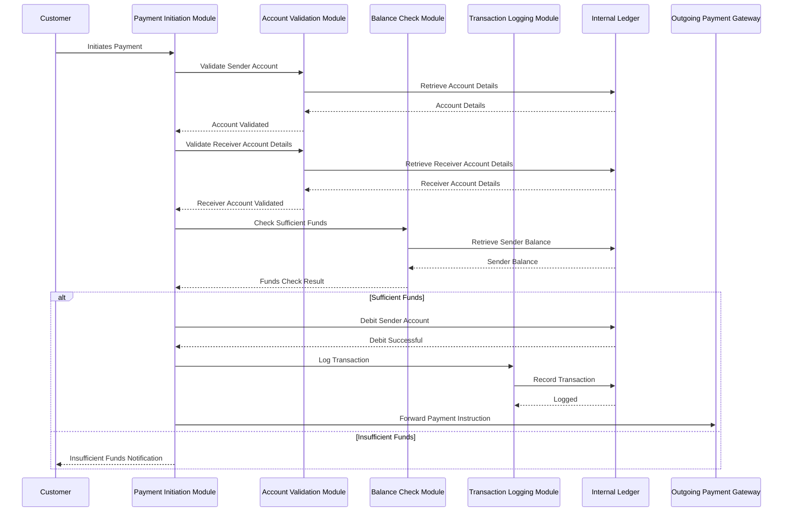

```mermaid
sequenceDiagram
    participant Customer
    participant Payment Initiation Module
    participant Account Validation Module
    participant Balance Check Module
    participant Transaction Logging Module
    participant Internal Ledger
    participant Outgoing Payment Gateway

    Customer->>Payment Initiation Module: Initiates Payment
    Payment Initiation Module->>Account Validation Module: Validate Sender Account
    Account Validation Module->>Internal Ledger: Retrieve Account Details
    Internal Ledger-->>Account Validation Module: Account Details
    Account Validation Module-->>Payment Initiation Module: Account Validated

    Payment Initiation Module->>Account Validation Module: Validate Receiver Account Details
    Account Validation Module->>Internal Ledger: Retrieve Receiver Account Details
    Internal Ledger-->>Account Validation Module: Receiver Account Details
    Account Validation Module-->>Payment Initiation Module: Receiver Account Validated

    Payment Initiation Module->>Balance Check Module: Check Sufficient Funds
    Balance Check Module->>Internal Ledger: Retrieve Sender Balance
    Internal Ledger-->>Balance Check Module: Sender Balance
    Balance Check Module-->>Payment Initiation Module: Funds Check Result

    alt Sufficient Funds
        Payment Initiation Module->>Internal Ledger: Debit Sender Account
        Internal Ledger-->>Payment Initiation Module: Debit Successful
        Payment Initiation Module->>Transaction Logging Module: Log Transaction
        Transaction Logging Module->>Internal Ledger: Record Transaction
        Internal Ledger-->>Transaction Logging Module: Logged

        Payment Initiation Module->>Outgoing Payment Gateway: Forward Payment Instruction
    else Insufficient Funds
        Payment Initiation Module-->>Customer: Insufficient Funds Notification
    end
```
