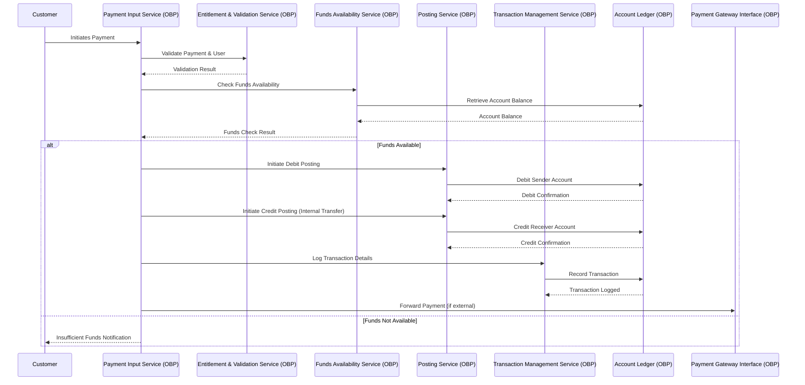

```mermaid
sequenceDiagram
    participant Customer
    participant Payment Input Service (OBP)
    participant Entitlement & Validation Service (OBP)
    participant Funds Availability Service (OBP)
    participant Posting Service (OBP)
    participant Transaction Management Service (OBP)
    participant Account Ledger (OBP)
    participant Payment Gateway Interface (OBP)

    Customer->>Payment Input Service (OBP): Initiates Payment
    Payment Input Service (OBP)->>Entitlement & Validation Service (OBP): Validate Payment & User
    Entitlement & Validation Service (OBP)-->>Payment Input Service (OBP): Validation Result

    Payment Input Service (OBP)->>Funds Availability Service (OBP): Check Funds Availability
    Funds Availability Service (OBP)->>Account Ledger (OBP): Retrieve Account Balance
    Account Ledger (OBP)-->>Funds Availability Service (OBP): Account Balance
    Funds Availability Service (OBP)-->>Payment Input Service (OBP): Funds Check Result

    alt Funds Available
        Payment Input Service (OBP)->>Posting Service (OBP): Initiate Debit Posting
        Posting Service (OBP)->>Account Ledger (OBP): Debit Sender Account
        Account Ledger (OBP)-->>Posting Service (OBP): Debit Confirmation

        Payment Input Service (OBP)->>Posting Service (OBP): Initiate Credit Posting (Internal Transfer)
        Posting Service (OBP)->>Account Ledger (OBP): Credit Receiver Account
        Account Ledger (OBP)-->>Posting Service (OBP): Credit Confirmation

        Payment Input Service (OBP)->>Transaction Management Service (OBP): Log Transaction Details
        Transaction Management Service (OBP)->>Account Ledger (OBP): Record Transaction
        Account Ledger (OBP)-->>Transaction Management Service (OBP): Transaction Logged

        Payment Input Service (OBP)->>Payment Gateway Interface (OBP): Forward Payment (if external)
    else Funds Not Available
        Payment Input Service (OBP)-->>Customer: Insufficient Funds Notification
    end
```
